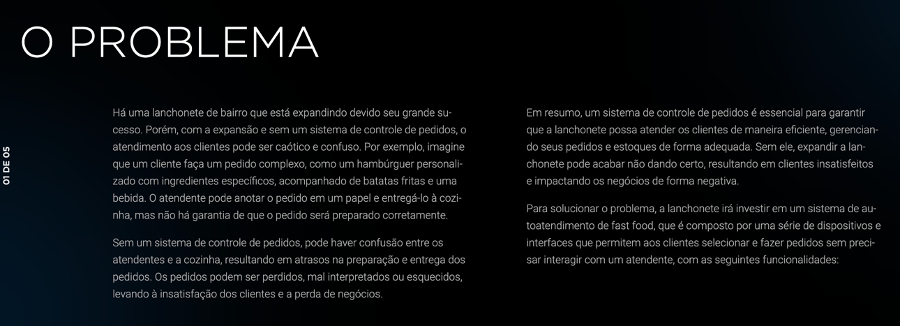
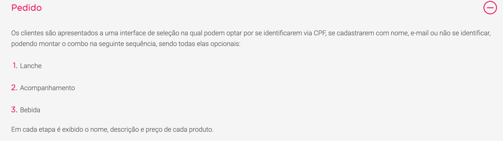
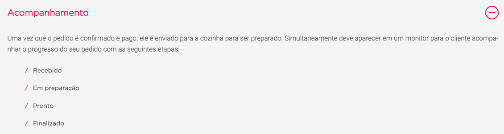
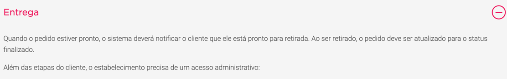
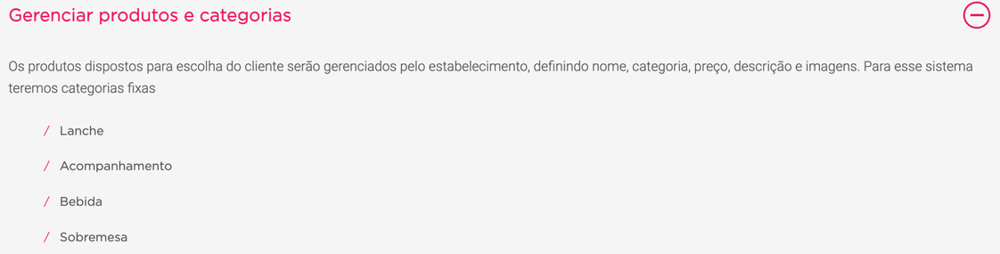
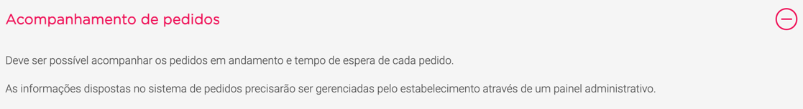

# fiap-fastfood




# Entregáveis








# Recursos e Bibliotecas
- [x] Java 17
- [x] Mongo
- [x] RabbitMQ
- [x] Spring Boot
- [x] MapStruct
- [x] Vavr
- [x] JsonPatch


# Dicionário de Linguagem Ubíqua

Termos utilizados na implementação (Presentes em Código)

- **Cliente/Customer**: O consumidor que realiza um pedido no restaurante.
- **Pedido/Order**: A lista de produtos (seja uma bebida, lanche, acompanhamento e/ou sobremesa) realizada pelo cliente no restaurante.
- **Produto/Product**: Item que será consumido pelo cliente, que se enquadra dentro de uma categoria, como por exemplo: bebida, lanche, acompanhamento e/ou sobremesa.
- **Categoria/Product Type**: Como os produtos são dispostos e gerenciados pelo estabelecimento: bebidas, lanches, acompanhamentos e/ou sobremesas.
- **Esteira de Pedidos/Order Tracking**: Responsável pelo andamento e monitoramento do estado do pedido.
- **Funcionário/Employee**: Funcionário do estabelecimento.

# Detalhes da Implementação MVP 1

## [Gerenciamento de produtos]([ProductController.java](fastfood-api%2Fsrc%2Fmain%2Fjava%2Fio%2Ffiap%2Ffastfood%2Fdriver%2Fcontroller%2Fproduct%2FProductController.java))
A aplicação dispõe de operações que permitem a inserção, edição, listagem(paginada) e a remoção de produtos. Em detalhe a possibilidade de se filtar produtos por categoria ao listar os mesmos.
Não há controle de estoque implementado na versão atual da aplicação.

### Mapeamento da entidade
    id : Identificador do produto, gerado automaticamente pela base de dados
    id da categoria : Identificador da categoria do produto
    descricao : Descrição do produto
    categoria : { 
        id da categoria : Identificador da categoria do produto
        descricao : Descrição da categoria
    }

## [Gerenciamento de Clientes]([CustomerController.java](fastfood-api%2Fsrc%2Fmain%2Fjava%2Fio%2Ffiap%2Ffastfood%2Fdriver%2Fcontroller%2Fcustomer%2FCustomerController.java))
A aplicação dispõe de operações que permitem a inserção, edição, listagem(paginada) e a remoção de clientes.

### Mapeamento da entidade
    id : Identificador do produto, gerado automaticamente pela base de dados
    nome : Identificador da categoria do produto
    identidade :  {
        tipo : Tipo do documento, comumente RG ou CPF porém não há limitação de valores.
        numero : Número do documento
    }
    email : Email do cliente
    telefone : Telefone do Cliente

## [Faturamento]([BillingController.java](fastfood-api%2Fsrc%2Fmain%2Fjava%2Fio%2Ffiap%2Ffastfood%2Fdriver%2Fcontroller%2Fbilling%2FBillingController.java))
Trata-se de esboço de um possível controle de faturamento, porém nesta versão se limita a controlar os números de pedidos que são informados ao cliente.
Dispõe de duas operações, abertura e fechamento de dia. 
Ao abrir inicia-se do zero a contagem de pedidos diária, ao fechar apenas se marca o dia em questão como finalizado.

### Mapeamento da entidade
    id : Identificador único da base de dados
    data e hora de abertura : Data e hora em que se abriu o dia de faturamento 
    data e hora de fechamento : Data e hora em que se fechou o dia de faturamento

## Contador de pedidos
Durante a descoberta do produto identificamos a necessidade de se ter um número de pedido de fácil compreensão ao cliente. 
Desta forma, implementamos uma sequence que é reiniciada na abertura de um novo dia de faturamento.

### Mapeamento da entidade
    id : Identificador único da base de dados
    nome : Nome da sequência
    sequência : Valor atual da sequência

## [Pedido e Pagamento]([OrderController.java](fastfood-api%2Fsrc%2Fmain%2Fjava%2Fio%2Ffiap%2Ffastfood%2Fdriver%2Fcontroller%2Forder%2FOrderController.java))
Persistidos separadamente na base de dados, porém criados em conjunto ao se iniciar um novo pedido. 

Para o pagamento não existem operações que exponham consultas ou edições ao mesmo, sendo o estado do mesmo, nesta versão, mapeado em conjunto na esteira de pedidos.

Já para o pedido estão disponíveis as operações de inserção, edição e listagem. Sendo a listagem paginada e com opção de filtragem por id de pedido.

### Mapeamento da entidade de Pedidos
    id : Identificador único da base de dados
    id do cliente : Id de referência do cliente
    items : { 
        id do produto : Id de referência do produto
        quantidade : Quantidade solicitada do item em questão
    }
    data e hora : Data e hora do pedido
    numero do pedido : Número do Pedido, gerado pelo contador de pedidos

### Mapeamento da entidade de Pagamentos
    id : Identificador único da base de dados
    meio de pagamento : Meio escolhido para realização do pagamento
    valor : Valor a ser pago
    data e hora : Data e hora do pagamento
    id do pedido : Id de referência do pedido

## [Esteira de Pedidos]([OrderTrackingController.java](fastfood-api%2Fsrc%2Fmain%2Fjava%2Fio%2Ffiap%2Ffastfood%2Fdriver%2Fcontroller%2Ftracking%2FOrderTrackingController.java))
Criada para evitar alterações seguidas no domínio de pedidos, controla o fluxo de estados dos pedidos. 
Dispõe de operações que permitem a inserção, listagem por pedido e um relatório que cumpre um dos requisitos de negócio, listando pedidos com sua data de início e tempo decorrido.

### Mapeamento da entidade da Esteira de Pedidos
    id : Identificador único da base de dados
    id do pedido : Id de referência do pedido
    numero do pedido : Número do Pedido, gerado pelo contador de pedidos
    estado do pedido : [Estado do pedido]([OrderTrackingStatusTypeDTO.java](fastfood-api%2Fsrc%2Fmain%2Fjava%2Fio%2Ffiap%2Ffastfood%2Fdriver%2Fcontroller%2Ftracking%2Fdto%2FOrderTrackingStatusTypeDTO.java))
    visibilidade : Permissão de visibilidade do estado em questão, [Permissões]([OrderTrackingRoleTypeDTO.java](fastfood-api%2Fsrc%2Fmain%2Fjava%2Fio%2Ffiap%2Ffastfood%2Fdriver%2Fcontroller%2Ftracking%2Fdto%2FOrderTrackingRoleTypeDTO.java))
    data e hora : Data e hora da inserção do estado

## [Pagamentos (Integração)]([payment-mock-api](payment-mock-api))
Os pagamentos são inseridos em conjunto ao pedido, porém processados separadamente em uma api que mocka superficialmente os comportamentos de um broker de pagamentos.

A operação de pagamento segue o seguinte flux:
1. O cliente finaliza o preenchimento do pedido/pagamento [na controladora de pedidos do fastfood](fastfood-api%2Fsrc%2Fmain%2Fjava%2Fio%2Ffiap%2Ffastfood%2Fdriver%2Fcontroller%2Forder%2FOrderController.java);
2. Ambas as entidades são persistidas;
3. Uma requisição REST é feita para a [api de mock de pagamentos](payment-mock-api%2Fsrc%2Fmain%2Fjava%2Fio%2Ffiap%2Ffastfood%2Fdriver%2Fcontroller%2Fpayment%2FPaymentController.java);
4. [Api de mock de pagamentos](payment-mock-api%2Fsrc%2Fmain%2Fjava%2Fio%2Ffiap%2Ffastfood%2Fdriver%2Fcontroller%2Fpayment%2FPaymentController.java) persiste o pagamento em seu lado e então o encaminha a uma fila para processamento assíncrono;
5. Cada mensagem persistida na fila é lida e, neste mock, aprovada automáticamente;
6. Ainda no mesmo processo da fila, é feita uma chamada de volta à api de [Fastfood](fastfood-api) para notificar do aceite daquele pagamento em questão;
7. Ao receber a confirmação de pagamento, a api de [Fastfood](fastfood-api) registra um novo estado do pedido como 'PAYMENT_CONFIRMED'.

Um detalhe importante é que o [mock Pagamentos](payment-mock-api) desconhece a api de [Fastfood](fastfood-api), sendo os passos 6 e 7 possíveis pois no payload de criação de um pagamento junto a api de [Pagamentos](payment-mock-api) exige-se uma URI de callback. 

## Fluxo da aplicação
O fluxo planejado da aplicação segue os seguintes passos:
1. Cadastro de um ou mais produtos;
2. Cadastro de um ou mais clientes (opcional);
3. Abertura de um dia de faturamento;
4. Inserção de um pedido e pagamento;
5. Confirmação de pagamento automática (Webhook);
6. Atualização do estado do pedido na Esteira de Pedidos, conforme ordem: WAITING_PAYMENT > PAYMENT_CONFIRMED > PREPARING > READY > FINISHED
7. Consulta por pedido ou através do relatório de pedidos.

# Início rápido

```shell 
docker-compose up
```
Ou, ao rodar em máquinas com processadores arm64:
```shell
docker compose --file docker-compose-arm64.yaml up
```
A aplicação será disponibilizada em [localhost:8080](http://localhost:8080), tendo seu swagger em [localhost:8080/swagger-ui.html](http://localhost:8080/swagger-ui.html).

### [Coleções Postman / Insomnia](fastfood-api/collection)
